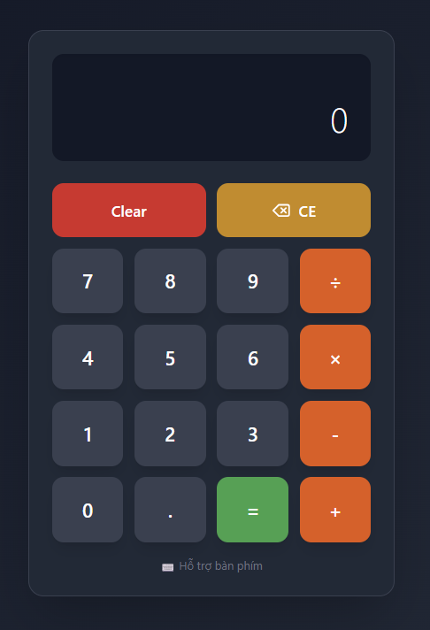

# Bài 05: Bài Tập - State & Events

## 🎯 Bài tập 1: Calculator App (Dễ)

### Yêu cầu:
Tạo máy tính đơn giản với state và events.

### Chức năng:
- Display hiển thị số và kết quả
- Buttons: 0-9, +, -, ×, ÷, =, C, CE
- Tính toán cơ bản
- Clear và Clear Entry
- Hiển thị phép tính đang thực hiện

### State cần quản lý:
```javascript
const [display, setDisplay] = useState('0')
const [previousValue, setPreviousValue] = useState(null)
const [operation, setOperation] = useState(null)
const [waitingForOperand, setWaitingForOperand] = useState(false)
```

### UI Requirements:
- Layout giống máy tính thật
- Button grid 4x4
- Display lớn ở trên
- Responsive
- Keyboard support (bonus)



---
